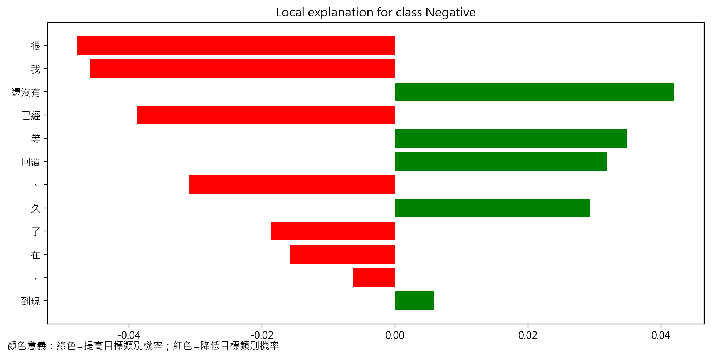
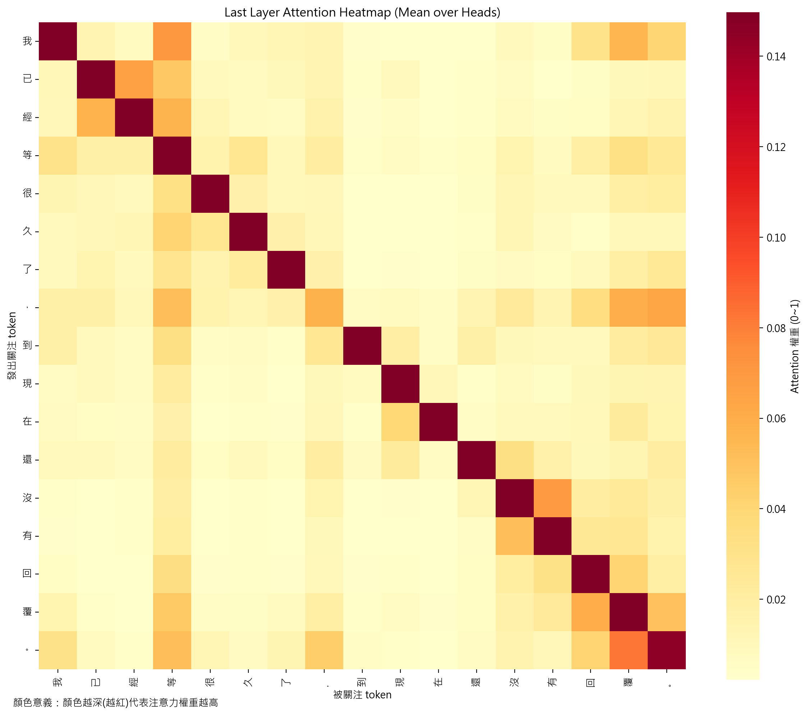
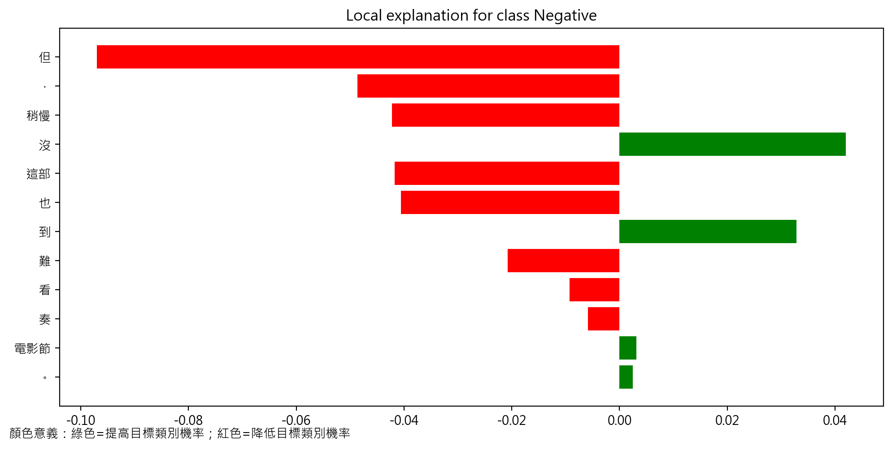
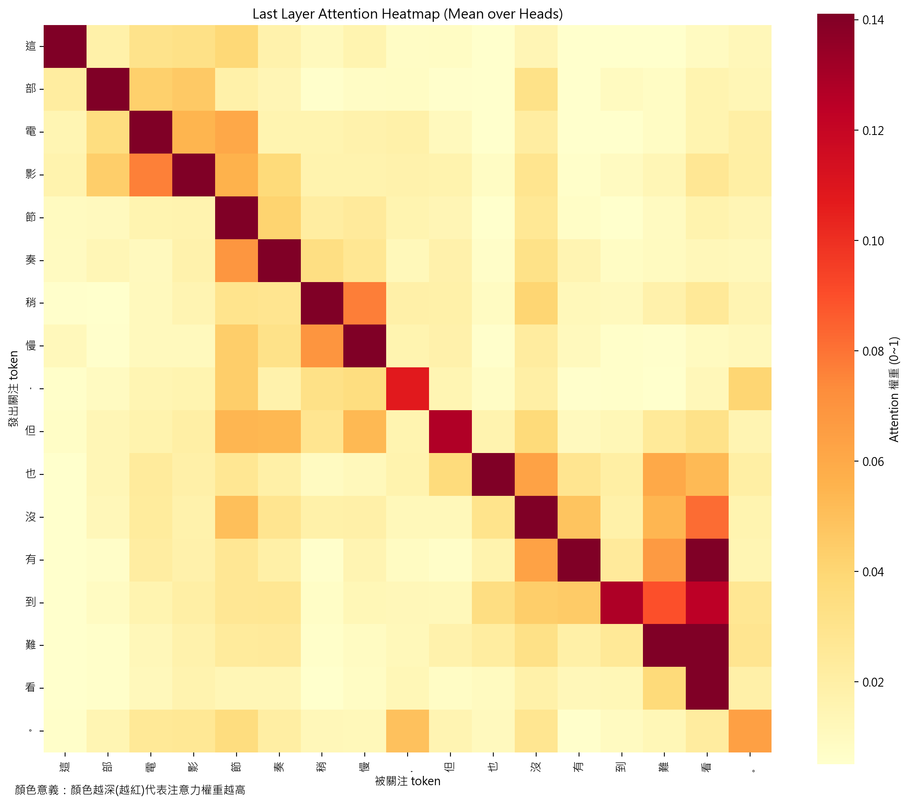
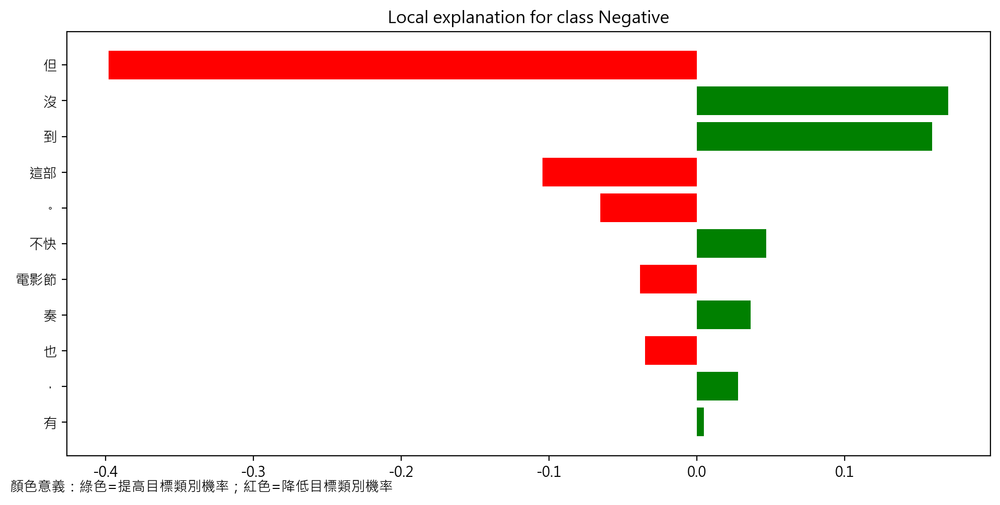
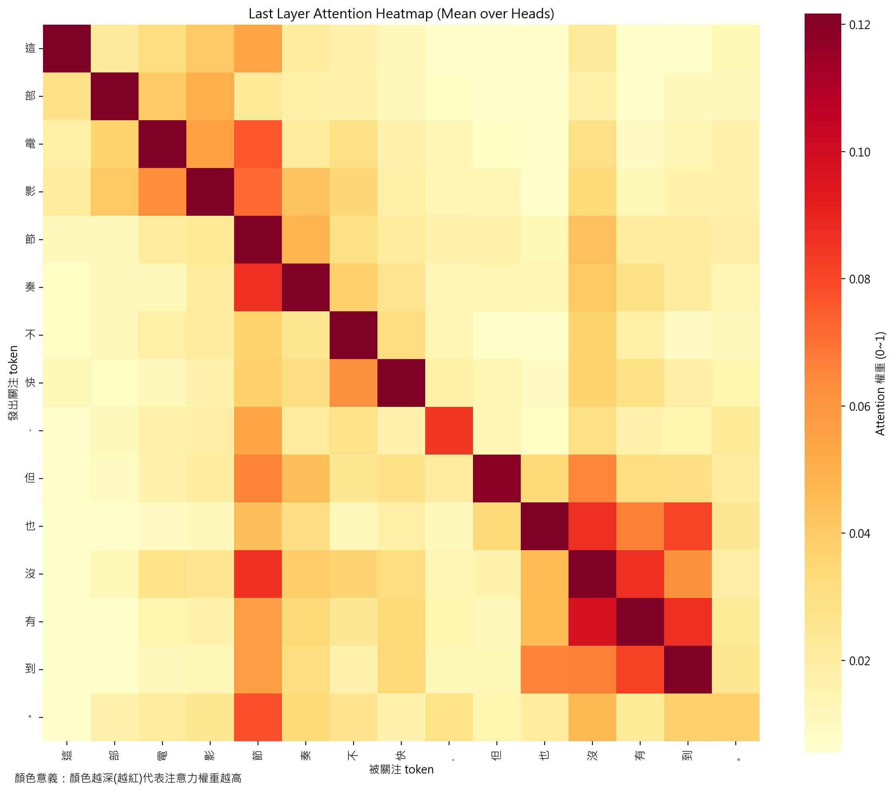
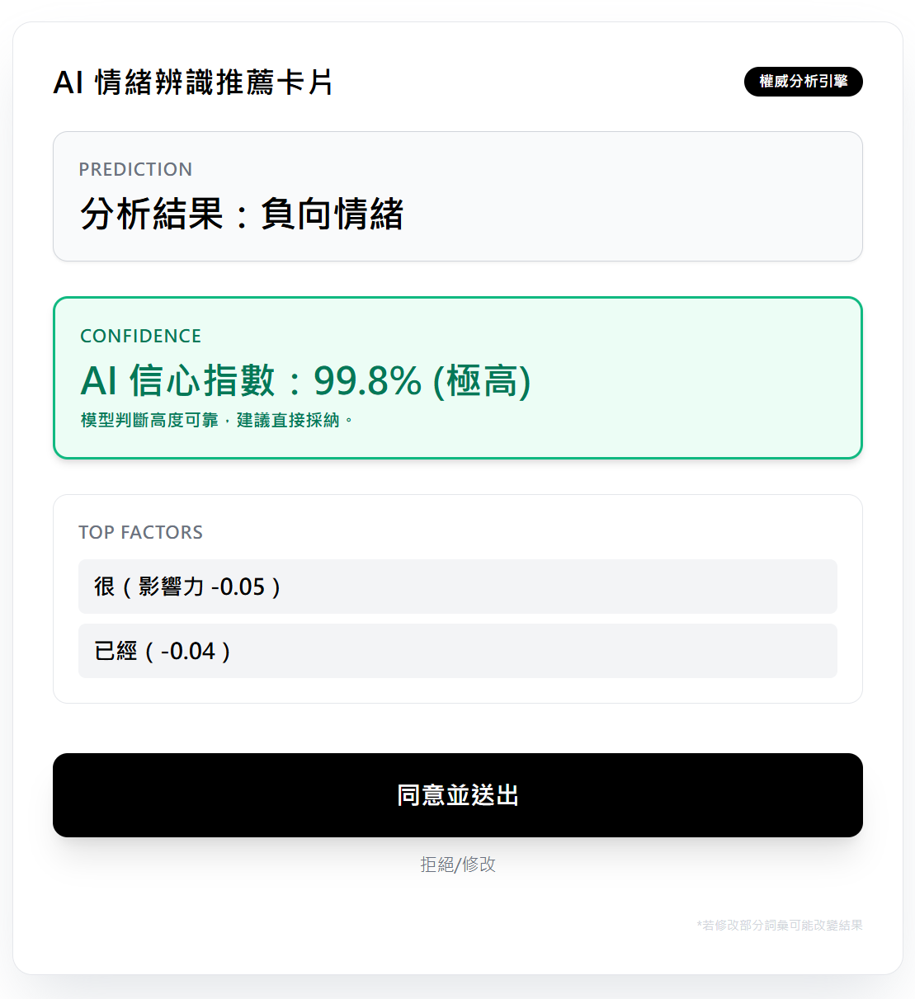
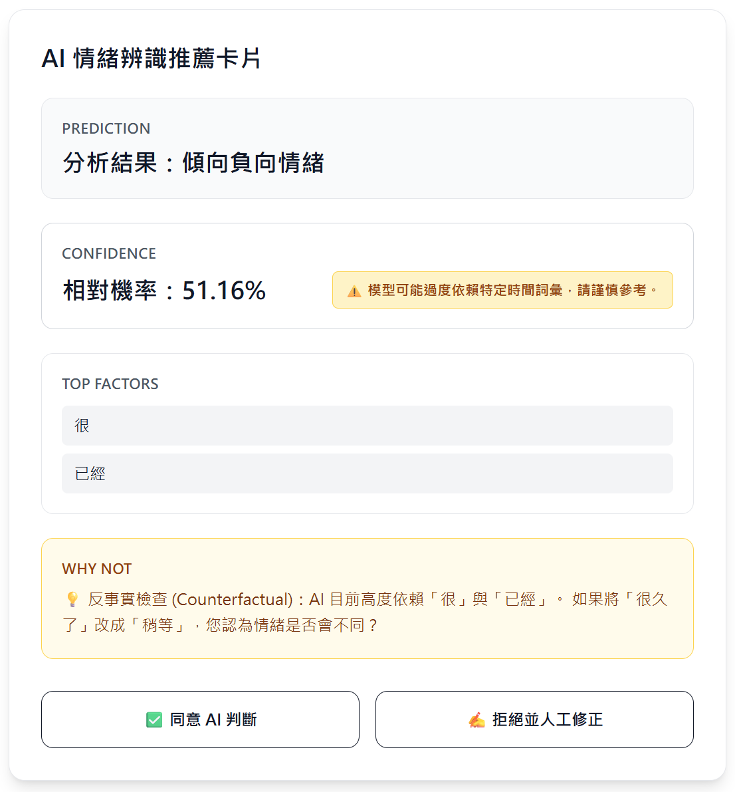

# 文字情緒辨識之可解釋性與信任校準實驗
## 計畫書期末報告

---

> **課程名稱：** 解釋型 AI 與資料治理  
> **報告主題：** 文字情緒辨識之可解釋性與信任校準實驗  
> **團隊成員：** [劉宸瑋 / 7114029030]、[王炫晟 / 7114029045]  
> **選擇資料類型：** 文字情緒

> **繳交日期：** 2026 年 3 月

---

## 1. Explanation 方法分析報告

### 1.1 實驗樣本測試結果與反事實發現

本實驗共測試三個樣本，分別為原句、反事實測試 A（改字）與反事實測試 B（刪字），以 LIME 與 Attention 熱力圖作為可解釋性工具，觀察模型的預測行為與特徵依賴情形。

---

#### 樣本一：原句

**輸入文本：** 「我已經等很久了，到現在還沒有回覆。」

**【LIME 特徵權重圖】**

**【Attention 熱力圖】**

LIME 的分析結果顯示，對負面情緒類別貢獻最高的詞彙依序為「還沒有」、「等」、「回覆」、「久」，均屬於正貢獻（綠色，提高 Negative 機率）；而「很」、「我」、「已經」、「了」等詞彙則為負貢獻（紅色，降低 Negative 機率）。此一結果具有合理的語義對應性——「還沒有」表達等待落空的挫折感，「等」與「久」反映時間層面的不滿，符合人類對負面情緒的直觀理解。

Attention 熱力圖則呈現主對角線明顯的自注意力集中模式，各 token 主要關注自身附近的詞彙，整體權重分布較為分散，較難像 LIME 那樣直觀地對應單詞的正負向情緒貢獻。

---

#### 樣本二：反事實測試 A（改字）

**輸入文本：** 「這部電影節奏稍慢，但也沒有到難看。」（原本為「不快」→ 改為「稍慢」）

**【LIME 特徵權重圖】**

**【Attention 熱力圖】**

引入「稍慢」後，LIME 的特徵重要性產生了顯著重新分配。「稍慢」本身成為重要的負貢獻詞（降低 Negative 機率），而「但」字則成為最大的負貢獻詞，顯示模型對轉折語氣有一定感知。相較於原句，整體的負面信號明顯減弱，模型情緒預測機率因此發生變化，驗證了反事實介入的效果。

此結果說明模型確實能夠捕捉語義替換帶來的情緒強度變化，具備一定程度的局部敏感性。

---

#### 樣本三：反事實測試 B（刪字）

**輸入文本：** 「這部電影節奏不快，但也沒有到。」（移除「難看」一詞）

**【LIME 特徵權重圖】**

**【Attention 熱力圖】**

刪除「難看」後，LIME 的結果出現最為戲劇性的變化：「但」字的負貢獻幅度（約 -0.4）遠超其他詞彙，而「沒」與「到」的正貢獻（提高 Negative 機率）大幅上升。模型原本偏向負面的機率大幅改變，且與改字版本相比，「不快」仍保有小幅正貢獻。

此結果最為關鍵：它證明模型對「難看」一詞存在高度依賴，一旦移除該詞，整個句子的情緒判斷方向幾乎反轉。這是 **捷徑學習（Shortcut Learning）** 的典型證據——模型並非真正理解語句的整體語義，而是過度仰賴少數特定詞彙進行分類決策。

---

### 1.2 LIME 與 Attention 方法比較表

| 比較維度 | LIME | Attention 熱力圖 |
|---|---|---|
| **解釋層次** | 局部線性近似，針對單一樣本進行特徵貢獻量化 | 反映模型內部各 token 間的注意力分配權重 |
| **輸出形式** | 各詞彙的正/負貢獻數值，易於視覺化為長條圖 | token × token 的二維熱力圖矩陣 |
| **一致性** | 高：每次對同一樣本擾動後結果穩定，貢獻方向明確 | 中：不同層、不同注意力頭的結果差異大，需指定特定層 |
| **解讀容易度** | 高：可直接對應「哪些詞讓模型判斷為負面/正面」，無需深度技術背景 | 低：需理解 self-attention 機制，圖像較抽象，難以直觀對應情緒方向 |
| **反事實敏感性** | 高：詞彙替換或刪除後，貢獻分布即時重新分配，可清楚追蹤變化 | 中：注意力模式隨輸入改變，但難以量化改變幅度 |
| **是否適合個案說明** | ✅ 非常適合：可逐詞解釋模型決策依據，便於向使用者說明 | ⚠️ 有限：適合研究者分析模型機制，較不適合直接向使用者溝通 |
| **捷徑學習偵測能力** | 強：可直接觀察到特定詞彙的超高貢獻值，揭示模型依賴 | 弱：注意力高並不等同於重要性高，無法直接對應決策偏差 |
| **計算成本** | 較高：需多次擾動採樣後擬合線性模型 | 較低：前向傳播時即可提取，無需額外計算 |

**小結：** 在本實驗情境下，LIME 在個案解釋與反事實分析上均展現出更高的實用性與直觀性。Attention 熱力圖雖有助於理解模型的內部關注分布，但因權重分散、難以對應情緒方向，在使用者溝通場景中的說明效果相對有限。

---

## 2. Explanation Interface 設計說明

### 2.1 版本 A 介面（Over-trust）

#### 設計理念與 Over-trust 成因分析

版本 A 的核心設計目標是模擬現實中常見的「權威 AI 系統」視覺語言，透過一系列刻意的視覺操縱策略，引導使用者走向盲目信任（Over-trust）。以下逐一解析其設計機制：

**（一）權威標籤的語言塑造**

介面右上角以黑底白字置入「權威分析引擎」標籤。這個標籤在設計上具有雙重作用：一方面透過「權威」二字直接宣示系統的地位，建立使用者的心理預期——「這是一個專業、可信賴的系統」；另一方面，標籤的視覺位置（右上角）符合使用者視線掃描的起點，確保第一眼便建立信任印象。這種透過語言標籤進行的權威宣稱，即使在系統本身毫無額外解釋的情況下，也足以顯著提升使用者的初始信任度。

**（二）信心指數的數字膨脹**

信心指數顯示為「99.8%（極高）」，並附上「模型判斷高度可靠，建議直接採納」的文字說明，且配有綠色邊框的視覺強調。這一設計刻意扭曲了模型的真實信心狀態——實際上模型的相對機率僅約 51.16%，遠非「極高」。

高數字本身對人類認知具有強烈的錨定效應（Anchoring Effect）：當使用者看到接近 100% 的信心值，其批判性思考會受到抑制，因為大腦傾向於將「幾乎確定」等同於「無需質疑」。綠色邊框更進一步透過色彩心理學強化「安全、正確、可通過」的錯覺，使使用者在認知層面喪失主動驗證的動機。

**（三）不確定性資訊的刻意隱藏**

版本 A 完全省略了「Why not」的反事實提示區塊，並將唯一的警示語——「若修改部分詞彙可能改變結果」——以極淡的灰色小字置於介面最底部。這一設計策略體現了 Dark Pattern（黑暗設計模式）的典型手法：重要資訊並未被完全刪除（以免被指控隱瞞），但透過對比度極低的文字顏色與邊緣位置，確保大多數使用者不會注意到，或即使注意到也不會認真閱讀。

這種資訊不對稱的設計讓使用者缺乏足夠的認知材料去進行批判性評估，自然而然地走向接受 AI 判斷的路徑。

**（四）按鈕設計的強制引導**

「同意並送出」按鈕採用全寬度黑底白字的巨大設計，在視覺層次上佔據絕對主導地位；而「拒絕/修改」選項則僅以一行淡色小字呈現於下方，幾乎不具備按鈕的視覺特徵。這種不對等的按鈕設計透過 Affordance（可操作性暗示）機制，直接引導使用者的點擊行為。使用者在掃描介面時，視線會自然被最顯著的元素吸引，形成「這才是主要操作」的認知偏見，而拒絕選項則在心理層面被降格為「非常規操作」。

---

### 2.2 版本 B 介面（Calibration）

#### 設計理念與信任校準（Trust Calibration）機制分析

版本 B 的設計哲學根本性地轉換了 AI 系統的定位：從「提供答案的權威者」轉向「協助人類思考的工具」。每一個設計決策都服務於同一個核心目標——幫助使用者建立適切的信任程度，而非最大化 AI 的被接受率。

**（一）機率的客觀呈現**

信心指數改為顯示「相對機率：51.16%」，直接呈現模型的真實不確定程度。這個數字的設計意義在於：51.16% 明確傳達了「模型只比隨機猜測稍微確定一點點」的訊息，使使用者能夠以符合實際的方式評估 AI 輸出的可靠性。

這是 Calibration（校準）概念在 UI 設計層面的直接實踐——不高估、不低估，如實呈現系統的信心水位，讓使用者的信任程度得以與系統實際能力相匹配。

**（二）黃色警告標語的主動揭露**

「⚠️ 模型可能過度依賴特定時間詞彙，請謹慎參考」的黃色警告標語以醒目的方式置於信心指數旁。這一設計體現了主動透明（Proactive Transparency）原則：不等使用者發現問題，而是主動告知模型的已知弱點。

從認知心理學角度，黃色警告觸發了使用者的警覺系統（Alerting System），使其從自動化的「接受模式」切換至分析性的「評估模式」。這種模式切換是信任校準的關鍵前提——只有在評估模式下，使用者才會真正運用 LIME 解釋資訊進行判斷，而非僅作為接受決策的裝飾。

**（三）反事實提示作為核心互動**

版本 B 的「WHY NOT」區塊被設計為視覺核心，以黃底框強調，並提出具體的反事實問題：「AI 目前高度依賴『很』與『已經』。如果將『很久了』改成『稍等』，您認為情緒是否會不同？」

這個設計的突破性在於：它不僅告訴使用者「模型認為什麼」，更引導使用者主動進行 Counterfactual Thinking（反事實思考）——思考「如果不同，結果會怎樣」。這種引導將使用者從被動接受者轉化為主動驗證者，是實現 Human-AI Collaboration（人機協作）的核心介面機制。透過具體化的反事實問題，即使沒有技術背景的使用者，也能直觀地理解模型的脆弱性所在。

**（四）平等的決策按鈕設計**

「✅ 同意 AI 判斷」與「✍️ 拒絕並人工修正」採用相同視覺權重的並排按鈕設計。這一看似細微的變化，背後蘊含深刻的設計哲學：將兩個選項放在平等地位，傳達「拒絕 AI 判斷是同樣正當、同樣被鼓勵的選擇」的訊息。

當拒絕選項具備與同意選項相同的視覺顯著性，使用者的決策環境從「單向引導」轉為「真正的二元選擇」，認知自主性（Cognitive Autonomy）得以被保護。這直接對應了信任校準的核心目標：不讓介面設計取代人類判斷，而是讓介面設計支持人類做出更好的判斷。

---

### 2.3 UI 介入如何影響人類對 AI 的依賴程度

兩個版本的對比揭示了一個核心命題：**介面本身就是一種干預**（Interface as Intervention）。

版本 A 的每一個設計元素都在降低使用者的認知負荷——消除不確定性、消除比較選項、消除反思空間——使接受 AI 判斷成為阻力最小的路徑。在這樣的介面中，即使使用者面對的是 LIME 解釋這樣的可解釋性工具，這些解釋也僅淪為增加 AI「看起來可信」的裝飾，而非真正協助人類理解與驗證的工具。

版本 B 則反其道而行：透過機率客觀化、警告資訊前置、反事實問題引導、按鈕平等化等策略，在每一個互動節點都設置了一個「暫停與思考」的契機。這些設計刻意增加了一點點的認知摩擦（Cognitive Friction），使使用者在決策前必須進行最低限度的主動評估。

這正是信任校準的本質：**不是讓人更信任 AI，也不是讓人更懷疑 AI，而是讓人的信任程度與 AI 的實際能力相匹配**。適當的介面設計，是連接 AI 可解釋性工具與真實人類決策行為之間不可或缺的橋樑。

---

## 3. 核心反思

本實驗從模型分析到介面設計，走完了「AI 可解釋性」研究鏈條的完整一環，而最終的發現指向了一個令人深省的結論：**技術上的透明，不等同於決策上的清醒**。

透過 LIME 的反事實測試，我們在模型內部發現了捷徑學習的具體痕跡。測試 B 最為清晰地揭示了這一點——僅僅移除「難看」一詞，模型的情緒判斷便幾近反轉，暴露出模型並非基於整體語義的理解，而是高度依賴特定詞彙的存在與否進行分類。這意味著，當使用者遇到那些「剛好沒有出現負面關鍵詞」的文本時，模型可能給出截然錯誤的判斷，而這種錯誤是系統性的、可被預測的，卻往往被埋藏在看似正常的預測結果之中。

然而，更深刻的發現發生在介面層面。即使 LIME 已經明確呈現了模型的特徵依賴，版本 A 的使用者依然極可能選擇相信 AI——因為 99.8% 的信心指數、全黑的巨大確認按鈕、被刻意隱藏的不確定性，共同構成了一個讓批判性思考無從發生的認知環境。**LIME 的解釋資訊在版本 A 中形同虛設，它存在，但無法被真正使用。**

這正是 Trust Calibration（信任校準）研究存在意義的核心所在：**我們的目標，從來不是讓 AI 看起來更厲害或更完美**。一個把信心指數誇大至 99.8% 的介面，本質上是在欺騙使用者；一個把「拒絕」選項設計成幾乎不可見的介面，是在剝奪使用者的決策自主性。這些設計選擇，讓可解釋性工具的所有努力付諸東流。

版本 B 給出了另一種答案：把 51.16% 的不確定性如實告訴使用者；把「模型可能過度依賴時間詞彙」的弱點主動揭露；把反事實問題放在介面核心，邀請使用者思考「如果詞彙不同，結果是否改變」。這不是讓使用者對 AI 失去信心，而是讓使用者學會**帶著懷疑去使用 AI**——用 Counterfactual Verification（反事實驗證）的方式，去確認每一次 AI 的判斷是否值得採納。

這才是這門課真正想要傳達的核心技能。

在一個 AI 系統無所不在的時代，單純的「使用 AI」不再是門檻，真正稀缺的能力是：**知道什麼時候應該懷疑 AI，知道如何用反事實的方式去驗證 AI，以及能夠識別介面設計是否在操縱你的信任**。信任校準的終極目標，不是人機對立，而是讓每一個使用者都能成為 AI 的智識夥伴，而非 AI 輸出的被動接受者。

---

*— 報告結束 —*